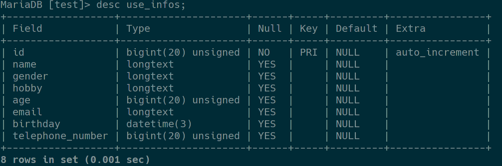
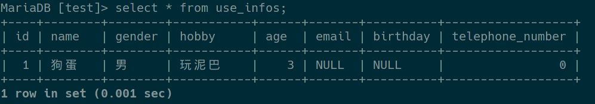
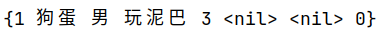
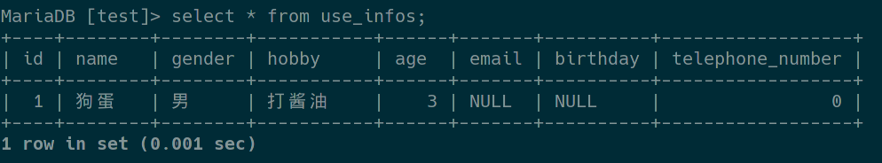
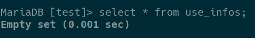
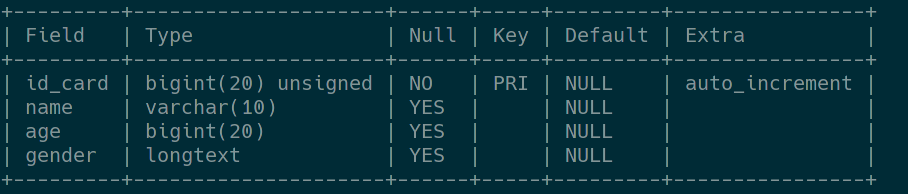
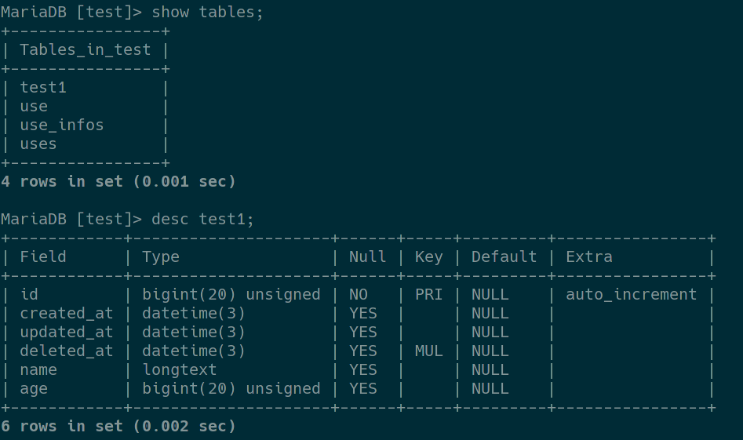
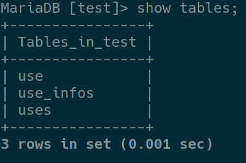
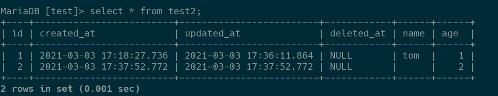
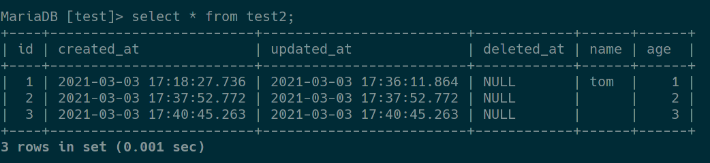

# `GORM`

## 导入

```go
import "gorm.io/gorm"
import "gorm.io/driver/mysql"
```

## 连接数据库

```go
dsn := "root:mysql@tcp(127.0.0.1:3306)/test?charset=utf8mb4&parseTime=True&loc=Local"
db, err := gorm.Open(mysql.Open(dsn), &gorm.Config{})
```

## 创建数据表

```go
type UseInfo struct {
	ID              uint
	Name            string
	Gender          string
	Hobby           string
	Age             uint
	Email           *string
	Birthday        *time.Time
	TelephoneNumber uint
}
func main(){
  db.AutoMigrate(&UseInfo{})  
}
```



## 添加数据

```go
use1 := UseInfo{ID: 1, Name: "狗蛋", Gender: "男", Hobby: "玩泥巴", Age: 3}
db.Create(&use1)
```



## 查询数据

### 一般查询

```go
var u UseInfo
db.First(&u) //查询表中第一条数据保存到u中
```




## 更新(修改)数据

```go
db.Model(&u).Update("hobby", "打酱油")
```



## 删除数据

```go
db.Delete(&u)
```



## 示例

```go
type UseInfo struct {
	ID              uint
	Name            string
	Gender          string
	Hobby           string
	Age             uint
	Email           *string
	Birthday        *time.Time
	TelephoneNumber uint
}

func main() {
	//root:用户名
	//mysql:密码
	//test:数据库名
	//charset=utf8mb4:编码方式utf8
	//parseTime:解析时间类型
	//loc=Local:本机时间
	dsn := "root:mysql@tcp(127.0.0.1:3306)/test?charset=utf8mb4&parseTime=True&loc=Local"
	//连接MySQL数据库
	db, err := gorm.Open(mysql.Open(dsn), &gorm.Config{})
	if err != nil {
		return
	}
	//创建表、自动迁移
	db.AutoMigrate(&UseInfo{})
	//创建数据
	use1 := UseInfo{ID: 1, Name: "狗蛋", Gender: "男", Hobby: "玩泥巴", Age: 3}
	db.Create(&use1)
	//查询
	var u UseInfo
	db.First(&u) //查询表中第一条数据保存到u中
	fmt.Println(u)
	//更新
	db.Model(&u).Update("hobby", "打酱油")
	//删除
	db.Delete(&u)
}
```

# `GORM Model`的定义

## 主键、类型

### 自定义主键

```go
type Use struct {
	IdCard uint          `gorm:"primary_key"`      //自定义主键
	Name   string        `gorm:"type:varchar(10)"` //自定义数据类型
	Age    sql.NullInt64 //默认为0
	Gender string
}

func main() {
	dsn := "root:mysql@tcp(127.0.0.1:3306)/test?charset=utf8mb4&parseTime=True&loc=Local"
	db, err := gorm.Open(mysql.Open(dsn), &gorm.Config{})
	if err != nil {
		return
	}
	db.AutoMigrate(&Use{})
}
```

- `GORM`默认以ID作为主键



### 嵌套`GORM`默认主键

```go
type Test1 struct {
	gorm.Model //嵌入gorm默认model
	Name       string
	Age        uint
}

func main() {
	dsn := "root:mysql@tcp(127.0.0.1:3306)/test?charset=utf8mb4&parseTime=True&loc=Local"
	db, err := gorm.Open(mysql.Open(dsn), &gorm.Config{})
	if err != nil {
		return
	}
	db.AutoMigrate(&Test1{})
}
```



## 表名

- 表名默认就是结构体名称的复数

### 使用函数为数据表改名

- 默认不会删除内容，只会重新创建一张表
- 新版本更新后有bug

```go
type Use struct {
	IdCard uint          `gorm:"primary_key"`      //自定义主键
	Name   string        `gorm:"type:varchar(10)"` //自定义数据类型
	Age    sql.NullInt64 //默认为0
	Gender string
}

//将表名修改为use
func (Use) TableName() string {
	return "use"

}

func main() {
	dsn := "root:mysql@tcp(127.0.0.1:3306)/test?charset=utf8mb4&parseTime=True&loc=Local"
	db, err := gorm.Open(mysql.Open(dsn), &gorm.Config{})
	if err != nil {
		return
	}
	db.AutoMigrate(&Use{})
}
```



### 使用`Table()`函数创建指定表名

```go
type Test1 struct {
   gorm.Model //嵌入gorm默认model
   Name       string
   Age        uint
}

func main() {
   dsn := "root:mysql@tcp(127.0.0.1:3306)/test?charset=utf8mb4&parseTime=True&loc=Local"
   db, err := gorm.Open(mysql.Open(dsn), &gorm.Config{})
   if err != nil {
      return
   }
   //创建一个 demo1 的表名
   db.Table("demo1").AutoMigrate(&Test1{})
}	
```

## 默认字段

```go
type Test2 struct {
	gorm.Model        //嵌入gorm默认model
	Name       string `gorm:"default:'tom'"`
	Age        uint
}

func main() {
	dsn := "root:mysql@tcp(127.0.0.1:3306)/test?charset=utf8mb4&parseTime=True&loc=Local"
	db, err := gorm.Open(mysql.Open(dsn), &gorm.Config{})
	if err != nil {
		return
	}
	//创建一个 demo1 的表名
	db.AutoMigrate(&Test2{})
	value := Test2{Age: 1}
	db.Create(&value)
}
```

- `GORM`默认各种类型为0的值不录入数据库

### 输入特殊值0值

#### 使用指针的方式

```go
type Test2 struct {
	gorm.Model         //嵌入gorm默认model
	Name       *string `grom:"default:'tom'"`
	Age        uint
}

func main() {
	dsn := "root:mysql@tcp(127.0.0.1:3306)/test?charset=utf8mb4&parseTime=True&loc=Local"
	db, err := gorm.Open(mysql.Open(dsn), &gorm.Config{})
	if err != nil {
		return
	}
	//创建一个 demo1 的表名
	db.AutoMigrate(&Test2{})
	value := Test2{Age: 2,Name: new(string)}
	db.Create(&value)
}
```



#### 使用Scanner/Valuer

```go
type Test2 struct {
	gorm.Model                //嵌入gorm默认model
	Name       sql.NullString `grom:"default:'tom'"`
	Age        uint
}

func main() {
	dsn := "root:mysql@tcp(127.0.0.1:3306)/test?charset=utf8mb4&parseTime=True&loc=Local"
	db, err := gorm.Open(mysql.Open(dsn), &gorm.Config{})
	if err != nil {
		return
	}
	//创建一个 demo1 的表名
	db.AutoMigrate(&Test2{})
	value := Test2{Age: 3, Name: sql.NullString{"", true}} //如果输入的空字符串表示有值，则输入true
	db.Create(&value)
}
```

