# Gin

## 一 介绍

- Gin是一个golang的微框架，封装比较优雅，API友好，源码注释比较明确，具有快速灵活，容错方便等特点
- 对于golang而言，web框架的依赖要远比Python，Java之类的要小。自身的`net/http`足够简单，性能也非常不错
- 借助框架开发，不仅可以省去很多常用的封装带来的时间，也有助于团队的编码风格和形成规范

### 1.1 导入

```go
import "github.com/gin-gonic/gin"
```

### 1.2 hello world
```go
func main() {
	// 1.创建路由
	r := gin.Default()
	// 2.绑定路由规则
	//gin.Context封装了request和response
	r.GET("/", func(c *gin.Context) {
		// 返回信息
		// http.StatusOK连接成功
		str:="hello world"
		c.String(http.StatusOK, str)
	})
	// 3.监听端口，默认在8080
	r.Run("localhost:8888")
}
```

## 二.Gin路由

### 2.1 基本路由

框架中采用的路由库是基于[httprouter](https://github.com/julienschmidt/httprouter)做的

```go
func get(c *gin.Context) {

}

func main() {
	//创建路由
	r := gin.Default()

	//绑定路由规则
	//GET请求
	r.GET("/get", func(c *gin.Context) {
		c.String(http.StatusOK, "hello world")
	})
	//POST请求
	r.POST("/post", get(c))
	//PUT请求
	r.PUT("/put")

	//监听端口
	r.Run("localhost:8888")
}
```

### 2.2 URL参数
- gin支持Restful风格的API
- 即Representational State Transfer的缩写。直接翻译的意思是"表现层状态转化"，是一种互联网应用程序的API设计理念：URL定位资源，用HTTP描述操作
````go
func main() {
	//创建路由
	r := gin.Default()

	//API参数
	r.GET("/get/:name/*action", func(c *gin.Context) {
		//提取action值
		action := c.Param("action")
		//取出name值
		name := c.Param("name")
		//输出name
		c.String(http.StatusOK, name+" is "+action)
	})

	//监听端口
	r.Run("localhost:8888")
}
````

输出结果为：

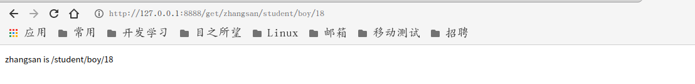

### 2.3 API参数

- URL参数可以通过DefaultQuery()或Query()方法获取
- DefaultQuery()若参数不村则，返回默认值，Query()若不存在，返回空串
- "?"后面的是query参数,多个参数用"&"连接

````go
func main() {
	//创建路由
	r := gin.Default()

	//URL参数
	r.GET("/welcome", func(c *gin.Context) {
        //name := c.Query("name") //取到值返回值,取不到返回空
		//age, ok := c.GetQuery("age")
		//if !ok {
		//	//取不到
		//	age = string(0)
		//}
		//c.JSON(200, gin.H{"age": age}) //取到返回值
		name := c.DefaultQuery("name", "jack") //DefaultQuery第二个参数是默认值
		c.String(http.StatusOK, fmt.Sprintf("Hello %s", name))
	})
	//监听端口
	r.Run("localhost:8888")
}
````

  输出结果：

不传参数时：

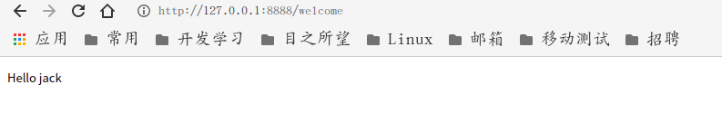

传入参数时：

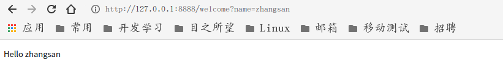

### 2.4 表单参数

- 表单传输为post请求，http常见的传输格式为四种：

- application/json											 -->json格式

- application/x-www-form-urlencoded        -->请求体

- application/xml                                              -->xml格式

- multipart/form-data                                      -->上传文件

  表单参数可以通过PostForm()方法获取，该方法默认解析的是`x-www-form-urlencoded`或`from-data`格式的参数

代码如下：

main.go

```go
package main

import (
	"fmt"
	"github.com/gin-gonic/gin"
)

func main() {
	r := gin.Default()
	//加载模板文件
	r.LoadHTMLFiles("login.html", "index.html")
	r.GET("/login", func(c *gin.Context) {
		c.HTML(200, "login.html", nil)
	})
	r.POST("/login", func(c *gin.Context) {
		//username := c.PostForm("username")
		//password := c.PostForm("password") //取到返回值,取不到返回空值
		//username := c.DefaultPostForm("username", "somebody")
		//password := c.DefaultPostForm("password", "***") //取到返回值,取不到返回空值,找不到key值返回默认值
		username, ok := c.GetPostForm("username")
		if !ok {
			username = "sb"
		}
		password, ok := c.GetPostForm("password")
		if !ok {
			password = "***"
		} //取到返回值,取不到返回空值,找不到key值返回默认值
		fmt.Println(username, password)
		c.HTML(200, "index.html", gin.H{"username": username, "password": password})
	})
	r.Run(":8888")
}
```

index.html

```html
<!DOCTYPE html>
<html lang="en">
<head>
    <meta charset="UTF-8">
    <title>index</title>
</head>
<body>
<h1>Hello,{{.username}}!</h1>
<h2>password:{{.password}}</h2>
</body>
</html>
```

login.html

```html
<!DOCTYPE html>
<html lang="en">
<head>
    <meta charset="UTF-8">
    <title>login</title>
</head>
<body>
<form action="login" method="post">
    <div>
        <label for="username">username</label>
        <input type="text" id="username" name="username">
    </div>
    <div>
        <label for="password">password</label>
        <input type="password" id="password" name="password">
    </div>
    <div>
        <input type="submit" value="提交">
    </div>
</form>
</body>
</html>
```

- get请求

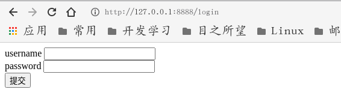

- post请求

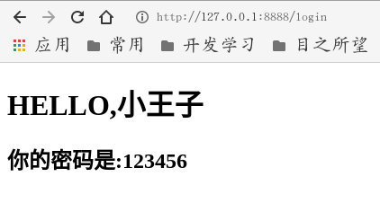

### 2.5 上传单个文件

- multipart/form-data格式用于文件上传
- gin文件上传与原生的net/http方法类似，不同在于gin把原生的request封装到c.Request中

服务器代码实现

```go
func main() {
	//创建路由
	r := gin.Default()

	//上传单个文件
	r.POST("/upload", func(c *gin.Context) {
		//上传单个文件
		file, err := c.FormFile("file")
		if err != nil {
			return
		}
		//打印文件名
		log.Println(file.Filename)
		//文件保存到根目录
		c.SaveUploadedFile(file, file.Filename)
		//打印信息
		c.String(200, fmt.Sprintf("file '%s' upload!\n"), file.Filename)
		//表单参数设置默认值
		types := c.DefaultPostForm("type", "alert")
		//接收表单用户名参数
		username := c.PostForm("username")
		//接收表单密码参数
		password := c.PostForm("password")
		//接收表单兴趣参数-->多选框
		hobbys := c.PostFormArray("hobby")
		c.String(http.StatusOK, fmt.Sprintf("type=%s,username=%s,password=%s,hobby=%v\n", types, username, password, hobbys))
	})

	//监听端口
	r.Run("localhost:8888")
}
```

网页代码实现

```html
<!DOCTYPE html>
<html lang="zh">

<head>
    <meta charset="UTF-8">
    <meta name="viewport" content="width=device-width, initial-scale=1.0">
    <title>登录</title>
</head>

<body>
    <form action="http://127.0.0.1:8888/upload" method="post" enctype="multipart/form-data">
        头&nbsp&nbsp&nbsp&nbsp像：
        <input type="file" name="file" id="file">
        <br>
        用户名：<input type="text" name="username" id="username">
        <br>
        密&nbsp&nbsp&nbsp&nbsp码：<input type="password" name="password" id="password">
        <br>
        兴&nbsp&nbsp&nbsp&nbsp趣：
        <input type="checkbox" name="hobby" id="run" value="跑步">跑步
        <input type="checkbox" name="hobby" id="game" value="游戏">游戏
        <input type="checkbox" name="hobby" id="money" value="金钱">金钱
        <br>
        <input type="submit" value="登录">
    </form>
</body>

</html>
```

输入前

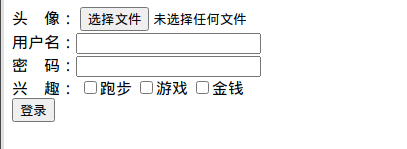

输入后

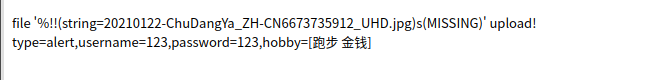


### 2.6 上传多个文件

网页代码

```go
<!DOCTYPE html>
<html lang="zh">

<head>
    <meta charset="UTF-8">
    <meta name="viewport" content="width=device-width, initial-scale=1.0">
    <title>登录</title>
</head>

<body>
    <form action="http://127.0.0.1:8888/upload" method="post" enctype="multipart/form-data">
        头&nbsp&nbsp&nbsp&nbsp像：
        <!-- multiple表示可以上传多个文件 -->
        <input type="file" name="files" id="files" multiple>
        <br>
        用户名：<input type="text" name="username" id="username">
        <br>
        密&nbsp&nbsp&nbsp&nbsp码：<input type="password" name="password" id="password">
        <br>
        兴&nbsp&nbsp&nbsp&nbsp趣：
        <input type="checkbox" name="hobby" id="run" value="跑步">跑步
        <input type="checkbox" name="hobby" id="game" value="游戏">游戏
        <input type="checkbox" name="hobby" id="money" value="金钱">金钱
        <br>
        <input type="submit" value="登录">
    </form>
</body>

</html>
```


服务器代码

```go
func main() {
	//创建路由
	r := gin.Default()
	//限制上传大小，默认为32M
	r.MaxMultipartMemory = 8 << 20 //8<<20==8*1024*1024
	//上传多个文件
	r.POST("/upload", func(c *gin.Context) {
		//接收表单
		form, err := c.MultipartForm()
		if err != nil {
			c.String(http.StatusBadRequest, fmt.Sprintf("get error:%s\n", err.Error()))
		}
		//获取所有图片
		files := form.File["files"]
		//遍历所有图片
		for _, file := range files {
			//逐个存储图片
			err := c.SaveUploadedFile(file, file.Filename)
			if err != nil {
				c.String(http.StatusBadRequest, fmt.Sprintf("upload err %s\n", err.Error()))
				return
			}
		}
		//打印信息
		c.String(200, fmt.Sprintf("upload ok %d files!\n"), len(files))
		//表单参数设置默认值
		types := c.DefaultPostForm("type", "alert")
		//接收表单用户名参数
		username := c.PostForm("username")
		//接收表单密码参数
		password := c.PostForm("password")
		//接收表单兴趣参数-->多选框
		hobbys := c.PostFormArray("hobby")
		c.String(http.StatusOK, fmt.Sprintf("type=%s,username=%s,password=%s,hobby=%v\n", types, username, password, hobbys))
	})

	//监听端口
	r.Run("localhost:8888")
}
```

输入

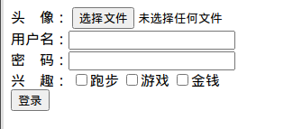

输出

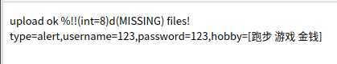

### 2.7 routes group

- routes group是为了管理一些相同的URL

```go
func main() {
	//创建路由
	r := gin.Default()
	//创建路由组1,处理GET请求
	v1 := r.Group("/v1")
	//{}是书写规范
	{
		v1.GET("/login", login)
		v1.GET("/submit", submit)
	}
	//创建路由组2,处理POST请求
	v2 := r.Group("/v2")
	{
		v2.POST("/login", login)
		v2.POST("/submit", submit)
	}
	//监听端口
	r.Run("localhost:8888")
}

func login(c *gin.Context) {
	name := c.DefaultQuery("name", "jack")
	c.String(http.StatusOK, fmt.Sprintf("hello %s\n", name))
}

func submit(c *gin.Context) {
	name := c.DefaultQuery("name", "lily")
	c.String(http.StatusOK, fmt.Sprintf("hello %s\n", name))
}
```

演示效果

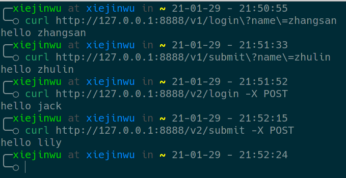

### 2.8 路由原理

- httproter会将所有路由规则构造一颗前缀树

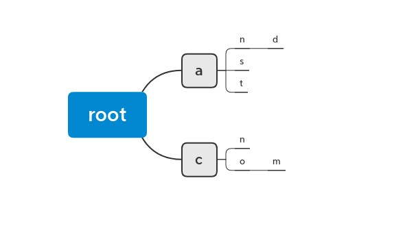

## 三、gin数据解析和绑定

### 3.1 Json 数据解析和绑定

- 客户端传参，后端接收并解析到结构体

- Json数据绑定到结构体

代码如下：

```go
//定义接收数据的结构体
type Login struct {
	//binding:"required"修饰的字段，若接收为空值，则报错;是必须字段
	Username string `form:"username" json:"username" uri:"username" xml:"username"`
	Password string `form:"password" json:"password" uri:"password" xml:"password"`
}

func main() {
	r := gin.Default()
	//Json绑定
	r.POST("loginJson", func(c *gin.Context) {
		//申明接受的变量
		var json Login
		//将Request中body的数据，自动按照json格式解析到结构体中
		err := c.ShouldBindJSON(&json)
		//返回错误信息
		if err != nil {
			//gin.H封装了生成json数据的工具
			c.JSON(http.StatusBadRequest, gin.H{"error": err.Error()})
			return
		}
		//判断用户名和密码是否正确
		if json.Username != "root" || json.Password != "admin" {
			c.JSON(http.StatusNotModified, gin.H{"status": "304"})
			return
		}
		c.JSON(http.StatusOK, gin.H{"status": "200"})
	})
	r.Run("localhost:8888")
}
```

### 3.2 表单数据解析和绑定

服务器代码：

```go
//定义接收数据的结构体
type Login struct {
	//binding:"required"修饰的字段，若接收为空值，则报错;是必须字段
	Username string `form:"username" json:"username" uri:"username" xml:"username"`
	Password string `form:"password" json:"password" uri:"password" xml:"password"`
}

func main() {
	r := gin.Default()
	//Form绑定
	r.POST("/loginForm", func(c *gin.Context) {
		//申明接受的变量
		var form Login
		//将Request中body的数据，自动按照json格式解析到结构体中
		err := c.Bind(&form) //默认解析并绑定form格式
		//返回错误信息
		if err != nil {
			//gin.H封装了生成json数据的工具
			c.JSON(http.StatusBadRequest, gin.H{"error": err.Error()})
			return
		}
		//判断用户名和密码是否正确
		if form.Username != "root" || form.Password != "admin" {
			c.JSON(http.StatusNotModified, gin.H{"status": "304"})
			return
		}
		c.JSON(http.StatusOK, gin.H{"status": "200"})
	})
	r.Run("localhost:8888")
}
```

网页代码：

```html
<!DOCTYPE html>
<html lang="zh">

<head>
    <meta charset="UTF-8">
    <meta name="viewport" content="width=device-width, initial-scale=1.0">
    <title>登录</title>
</head>

<body>
    <form action="http://127.0.0.1:8888/loginForm" method="post" enctype="multipart/form-data">
        头&nbsp&nbsp&nbsp&nbsp像：
        <!-- multiple表示可以上传多个文件 -->
        <input type="file" name="files" id="files" multiple>
        <br>
        用户名：<input type="text" name="username" id="username">
        <br>
        密&nbsp&nbsp&nbsp&nbsp码：<input type="password" name="password" id="password">
        <br>
        兴&nbsp&nbsp&nbsp&nbsp趣：
        <input type="checkbox" name="hobby" id="run" value="跑步">跑步
        <input type="checkbox" name="hobby" id="game" value="游戏">游戏
        <input type="checkbox" name="hobby" id="money" value="金钱">金钱
        <br>
        <input type="submit" value="登录">
    </form>
</body>

</html>
```

输入前：

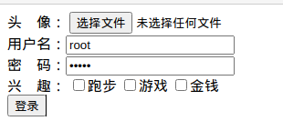

输入后：

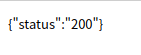

### 3.3 URI数据解析和绑定

```go
//定义接收数据的结构体
type Login struct {
	//binding:"required"修饰的字段，若接收为空值，则报错;是必须字段
	Username string `form:"username" json:"username" uri:"username" xml:"username"`
	Password string `form:"password" json:"password" uri:"password" xml:"password"`
}

func main() {
	r := gin.Default()
	//Form绑定
	r.GET("/:username/:password", func(c *gin.Context) {
		//申明接受的变量
		var uri Login
		//将Request中body的数据，自动按照json格式解析到结构体中
		err := c.ShouldBindUri(&uri)
		//返回错误信息
		if err != nil {
			//gin.H封装了生成json数据的工具
			c.JSON(http.StatusBadRequest, gin.H{"error": err.Error()})
			return
		}
		//判断用户名和密码是否正确
		if uri.Username != "root" || uri.Password != "admin" {
			c.JSON(http.StatusNotModified, gin.H{"status": "304"})
			return
		}
		c.JSON(http.StatusOK, gin.H{"status": "200"})
	})
	r.Run("localhost:8888")
}
```

结果显示：

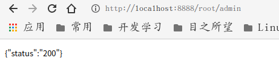

## 四、gin渲染

### 4.1 各种数据格式的响应

```go
func main() {
	//多种响应方式
	r := gin.Default()
	//1、json响应
	r.GET("/someJson", func(c *gin.Context) {
		c.JSON(http.StatusOK, gin.H{"message": "someJson", "status": 200})
	})
	//2、结构体响应
	r.GET("/someStruct", func(c *gin.Context) {
		var msg struct {
			Name    string
			Message string
			Number  int
		}
		msg.Name = "root"
		msg.Message = "message"
		msg.Number = 123
		c.JSON(http.StatusOK, msg)
	})
	//3、xml响应
	r.GET("/someXml", func(c *gin.Context) {
		c.XML(http.StatusOK,gin.H{"message":"xml"})
	})
	//4、YAML响应
	r.GET("/someYaml", func(c *gin.Context) {
		c.YAML(http.StatusOK,gin.H{"name":"zhangsan"})
	})
	//5、protobuf响应-->微服务
	r.Run("localhost:8888")
}
```

结果

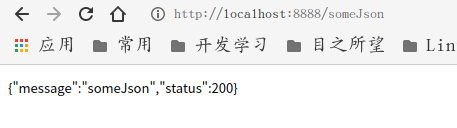

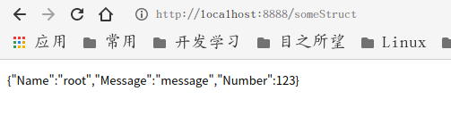

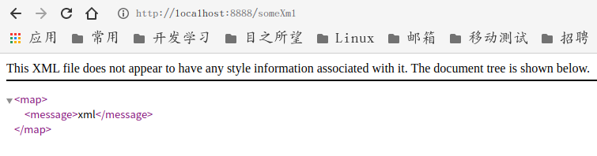

### 4.2 HTML模板渲染

- gin支持加载HTML模板, 然后根据模板参数进行配置并返回相应的数据，本质上就是字符串替换
- LoadHTMLGlob()方法可以加载模板文件

#### 4.2.1 渲染HTML文件

模板文件(index.html)

```tmpl
{{define "index.html"}}
    <!DOCTYPE html>
    <html lang="en">
    <head>
        <meta charset="UTF-8">
        <title>模板渲染</title>
    </head>
    <body>
    {{.title}}
    </body>
    </html>
{{end}}
```

渲染文件(main.go)

````go
package main

import (
	"github.com/gin-gonic/gin"
	"html/template"
)

func main() {
	r := gin.Default()
	//通过文件名加载模板渲染文件
	r.LoadHTMLFiles("templates/index.html")
	//通过文件路径加载模板渲染文件
	//r.LoadHTMLGlob("templates/*")
	//r.LoadHTMLGlob("templates/**/*") //模板渲染文件分文件夹储存
	r.GET("/index", func(c *gin.Context) {
		c.HTML(200, "index.html", gin.H{"title": "test"})
	})
	r.Run(":8888")
}
````

渲染结果

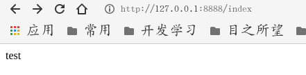

#### 4.2.2 给模板添加自定义函数

##### 4.2.2.1 模板不添加自定义函数

模板文件(index.html)

```html
{{define "index.html"}}
    <!DOCTYPE html>
    <html lang="en">
    <head>
        <meta charset="UTF-8">
        <title>模板渲染</title>
    </head>
    <body>
    {{/*数据渲染位置*/}}
    {{.title}}
    </body>
    </html>
{{end}}
```

渲染文件(main.go)

```go
package main

import (
	"github.com/gin-gonic/gin"
)

func main() {
	r := gin.Default()
	//通过文件名加载模板渲染文件
	r.LoadHTMLFiles("templates/index.html")
	r.GET("/index", func(c *gin.Context) {
		c.HTML(200, "index.html", gin.H{"title": "<a href='http://www.google.com'>谷歌</a>"})
	})
	r.Run(":8888")
}
```

渲染结果

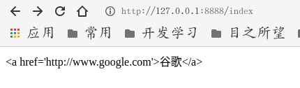

##### 4.2.2.2 模板添加自定义函数

模板文件(index.html)

```html
{{define "index.html"}}
    <!DOCTYPE html>
    <html lang="en">
    <head>
        <meta charset="UTF-8">
        <title>模板渲染</title>
    </head>
    <body>
    {{/*数据渲染位置*/}}
    {{.title| safe}}
    </body>
    </html>
{{end}}
```

渲染文件(main.go)

```go
package main

import (
	"github.com/gin-gonic/gin"
	"html/template"
)

func main() {
	r := gin.Default()
	//gin框架中给模板添加自定义函数
	r.SetFuncMap(template.FuncMap{
		"safe": func(str string) template.HTML {
			return template.HTML(str)
		},
	})
	//通过文件名加载模板渲染文件
	r.LoadHTMLFiles("templates/index.html")
	r.GET("/index", func(c *gin.Context) {
		c.HTML(200, "index.html", gin.H{"title": "<a href='http://www.google.com'>谷歌</a>"})
	})
	r.Run(":8888")
}
```

渲染结果

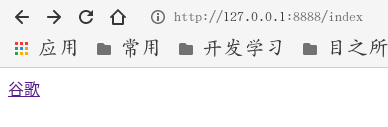

#### 4.2.3 渲染静态文件

- 静态文件:HTML页面上用到的样式文件(css文件/js文件/图片...)

模板文件

(index.html)

```html
{{define "index.html"}}
    <!DOCTYPE html>
    <html lang="en">
    <head>
        <meta charset="UTF-8">
        <title>模板渲染</title>
        {{/*加载静态文件css*/}}
        <link rel="stylesheet" href="static/index.css">
    </head>
    <body>
    {{/*数据渲染位置*/}}
    {{.title| safe}}
    </body>
    </html>
{{end}}
```

(index.css)

```css
body {
    background-color: gainsboro;
}
```

渲染文件(main.go)

```go
package main

import (
	"github.com/gin-gonic/gin"
	"html/template"
)

func main() {
	r := gin.Default()
	//加载静态文件
	r.Static("/static", "./statics") //第一个目录是在HTML文件中引入的目录,第二个目录是存放静态文件的目录
	//gin框架中给模板添加自定义函数
	r.SetFuncMap(template.FuncMap{
		"safe": func(str string) template.HTML {
			return template.HTML(str)
		},
	})
	//通过文件名加载模板渲染文件
	r.LoadHTMLFiles("templates/index.html")
	r.GET("/index", func(c *gin.Context) {
		c.HTML(200, "index.html", gin.H{"title": "<a href='http://www.google.com'>谷歌</a>"})
	})
	r.Run(":8888")
}
```

渲染结果

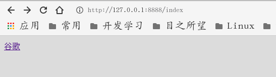

### 4.3 重定向

代码如下

````go
func main() {
	//重定向
	r := gin.Default()
	r.GET("redirect", func(c *gin.Context) {
		//支持内部和外部重定向
		c.Redirect(http.StatusMovedPermanently, "http://www.baidu.com/")
	})
	r.Run("localhost:8888")
}
````

### 4.4 同步异步

- goroutine机制可以方便地实现异步处理
- 另外，在异步启动新的goroutine时，不应该使用原始上下文，必须使用它的只读副本

```go
func main() {
	r := gin.Default()
	//1.异步
	r.GET("/long_async", func(c *gin.Context) {
		//异步需要一个副本，不能使用原本
		copyContext := c.Copy()
		//异步处理
		go func() {
			time.Sleep(3 * time.Second)
			log.Println("异步处理：" + copyContext.Request.URL.Path)
		}()
	})
	//2.同步
	r.GET("/long_sync", func(c *gin.Context) {
		//同步处理
		go func() {
			time.Sleep(3 * time.Second)
			log.Println("同步处理：" + c.Request.URL.Path)
		}()
	})
	r.Run("localhost:8888")
}
```

## 五.gin中间件

- gin中间件必须是一个`gin.HandleFanc`类型

### 5.1 全局中间件

```go
func MiddleWare() gin.HandlerFunc {
	return func(c *gin.Context) {
		startTime := time.Now()
		fmt.Println("中间件开始执行")
		//设置变量到Context的key中，可以通过GET()获取
		c.Set("request", "中间件")
		//执行函数
		c.Next()
		//中间件执行完的操作
		//中间件状态
		status := c.Writer.Status()
		fmt.Println("中间件执行完毕", status)
		//计算执行时间差
		subTime := time.Since(startTime)
		fmt.Println("time:", subTime)
	}
}

func main() {
	//全局中间件
	r := gin.Default()
	//注册中间件
	r.Use(MiddleWare())
	{
		r.GET("/middleware", func(c *gin.Context) {
			//取值
			result, ok := c.Get("request")
			if !ok {
				return
			}
			fmt.Println("result:", result)
			//页面接收
			c.JSON(http.StatusOK, gin.H{"request": result})
		})
	}
	r.Run("localhost:8888")
}
```

执行效果

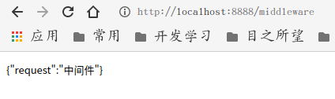

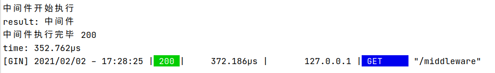

### 5.2 next()方法

- 看源码

### 5.3 局部中间件

```go
func MiddleWare1() gin.HandlerFunc {
	return func(c *gin.Context) {
		startTime := time.Now()
		fmt.Println("全局中间件开始执行")
		//设置变量到Context的key中，可以通过GET()获取
		c.Set("request", "全局中间件")
		//执行函数
		c.Next()
		//中间件执行完的操作
		//中间件状态
		status := c.Writer.Status()
		fmt.Println("全局中间件执行完毕", status)
		//计算执行时间差
		subTime := time.Since(startTime)
		fmt.Println("全局中间件执行时间:", subTime)
	}
}
func MiddleWare2() gin.HandlerFunc {
	return func(c *gin.Context) {
		startTime := time.Now()
		fmt.Println("局部中间件开始执行")
		//设置变量到Context的key中，可以通过GET()获取
		c.Set("request", "局部中间件")
		//执行函数
		c.Next()
		//中间件执行完的操作
		//中间件状态
		status := c.Writer.Status()
		fmt.Println("局部中间件执行完毕", status)
		//计算执行时间差
		subTime := time.Since(startTime)
		fmt.Println("局部中间件执行时间:", subTime)
	}
}
func main() {
	//全局中间件
	r := gin.Default()
	//注册中间件
	r.Use(MiddleWare1())
	{
		r.GET("/middleware1", func(c *gin.Context) {
			//取值
			result, ok := c.Get("request")
			if !ok {
				return
			}
			fmt.Println("result:", result)
			//页面接收
			c.JSON(http.StatusOK, gin.H{"request": result})
		})
		//根路由后面定义的局部中间件
		r.GET("/middleware2", MiddleWare2(), func(c *gin.Context) {
			//取值
			result, ok := c.Get("request")
			if !ok {
				return
			}
			fmt.Println("result:", result)
			//页面接收
			c.JSON(http.StatusOK, gin.H{"request": result})
		})
	}
	r.Run("localhost:8888")
}
```

演示效果

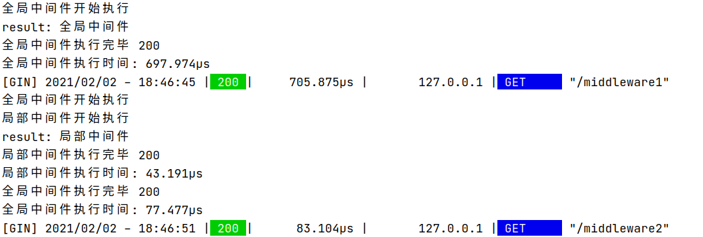

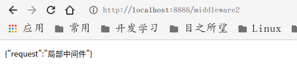

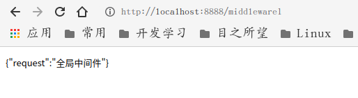

### 5.4 中间件小练习

```go
func Middleware() gin.HandlerFunc {
	return func(c *gin.Context) {
		start := time.Now()
		c.Next()
		end := time.Since(start)
		fmt.Println("程序用时：", end)
	}
}
func main() {
	r := gin.Default()
	shopping := r.Group("/shopping")
	{
		shopping.GET("/index", Middleware(), func(c *gin.Context) {
			c.String(http.StatusOK, "index")
		})
		shopping.GET("/home", Middleware(), func(c *gin.Context) {
			c.String(http.StatusOK, "home")
		})
	}
	r.Run("localhost:8888")
}
```

## 六.会话控制

### 6.1 cookie

#### 6.1.1 Cookie介绍

- HTTP是无状态协议，服务器不能记录浏览器的访问状态，也就是说服务器不能区分两次请求是否由同一个客户端发出
- Cookie就是解决HTTP协议无状态的方案之一，中文是小甜饼的意思
- Cookie实际上就是服务器保存在浏览器上的一段信息。浏览器有了Cookie之后，每次向服务器发送请求时都会同时将该信息发送给服务器，服务器收到请求后，就可以根据该信息处理请求
- Cookie由服务器创建，并发送给浏览器，最终由浏览器保存

####  6.1.2 Cookie的用途

- 测试服务端发送cookie给客户端，客户端请求时携带cookie

#### 6.1.3 cookie的使用

```go
func main() {
	r := gin.Default()
	//服务端给客户端cookie
	r.GET("/cookie", func(c *gin.Context) {
		//获取客户端是否携带cookie
		cookie, err := c.Cookie("key_cookie")
		if err != nil {
			//给客户端设置cookie
			//name cookie的名字
			//value cookie的值
			//maxAge cookie的响应时间，单位秒
			//path cookie所在目录
			//domain 域名
			//secure 是否只能通过https访问
			//httpOnly 是否允许别人通过js获取自己的cookie
			c.SetCookie("key_cookie", "value_cookie", 60, "/", "localhost", false, true)
		}
		//打印cookie
		fmt.Printf("cookie的值是：%s\n", cookie)
	})
	r.Run("localhost:8888")
}
```

#### 6.1.4 cookie练习

- 模拟实现权限验证中间件

  - 有两个路由`home`和`login`
  - `login`用于设置cookie
  - `home`用于访问查看信息的请求
  - 在请求`home`之前，先跑中间件，检验是否存在cookie
  - 检验通过，请求完成

```go
//中间件
func AuthmiddleWare() gin.HandlerFunc {
	return func(c *gin.Context) {
		cookie, err := c.Cookie("cookie")
		if err != nil {
			c.JSON(http.StatusUnauthorized, gin.H{"error": "err"})
			//若不通过，则不再调用后续的函数处理
			c.Abort()
			return
		}
		if cookie != "cookie_value" {
			c.JSON(http.StatusUnauthorized, gin.H{"error": "err"})
			//若不通过，则不再调用后续的函数处理
			c.Abort()
			return
		}
		c.Next()
		return
	}
}

func main() {
	r := gin.Default()
	r.GET("/home", AuthmiddleWare(), func(c *gin.Context) {
		cookie, _ := c.Cookie("cookie")
		c.JSON(200, gin.H{"data": "home", "cookie": cookie})
	})
	r.GET("/login", func(c *gin.Context) {
		//设置cookie
		c.SetCookie("cookie", "cookie_value", 60, "/", "localhost", false, true)
		//返回信息
		c.String(200, "login successful!")
	})
	r.Run("localhost:8888")
}
```

- 访问`/login`和`/home`进行测试

#### 6.1.5 cookie的缺点

- 不安全，明文
- 增加带宽消耗
- 可以被禁用
- cookie有上限

### 6.2 Sessions

gorilla/sessions为自定义session后端提供cookie和文件系统session以及基础结构。

[session官网](http://www.gorillatoolkit.org/pkg/sessions)

主要功能是：

- 简单的API：将其用作设置签名（以及可选的加密）cookie的简便方法。
- 内置的后端可将session存储在cookie或文件系统中。
- Flash消息：一直持续读取的session值。
- 切换session持久性（又称“记住我”）和设置其他属性的便捷方法。
- 旋转身份验证和加密密钥的机制。
- 每个请求有多个session，即使使用不同的后端也是如此。
- 自定义session后端的接口和基础结构：可以使用通用API检索并批量保存来自不同商店的session。

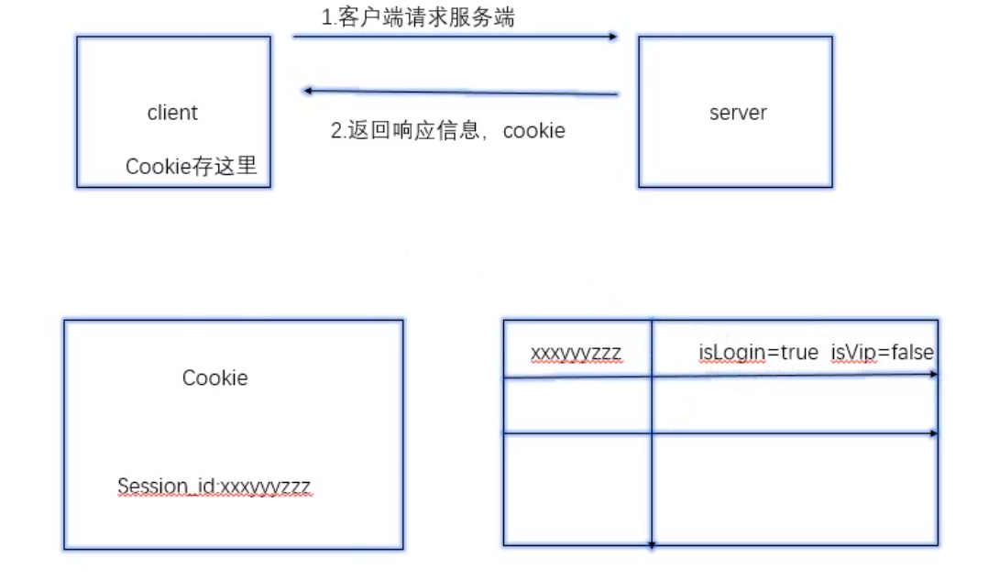

#### Session中间件开发

- 本质上k-v系统，通过key进行增删改查
- Session可以存储在内存或redis（2个版本）

  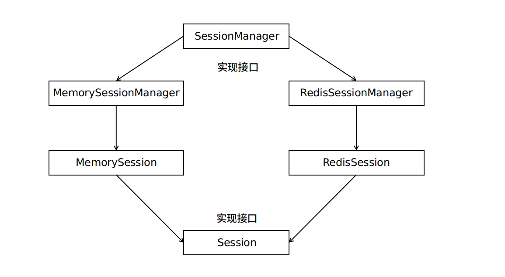

##### Session接口设计

- Set()
- Get()
- Del()
- Save()：session存储，redis延迟加载

session.go

```go
type Session interface {
	Set(key string, value interface{}) error
	Get(key string) (value interface{}, err error)
	Del(key string) error
	Save() error
}
```

##### SessionManager接口设计

- Init()：初始化，加载redis地址
- CreateSession()：创建一个新的Sessions
- GetSession()：通过sessionId获取session对象

session_manager.go

```go
//定义管理者，管理所有的session
type SessionManager interface {
	Init(addr string, options ...string) error
	CreateSession() (Session, error)
	GetSession(sessionId string) (Session, error)
}
```

##### MemorySession设计

- 定义MemorySession对象（字段：sessionId;存k-v的map，读写锁）
- 构造函数，为了获取对象
- Set()
- Get()
- Del()
- Save()

memory_session.go

```go
type MemorySession struct {
	sessionId string
	data      map[string]interface{}
	rwLock    sync.RWMutex
}

//构造函数
func NewMemorySession(id string) *MemorySession {
	s := &MemorySession{sessionId: id, data: make(map[string]interface{}, 16)}
	return s
}
func (m *MemorySession) Set(key string, value interface{}) error {
	//加锁
	m.rwLock.Lock()
	//解锁
	defer m.rwLock.Unlock()
	//设置值
	m.data[key] = value
	return nil
}
func (m *MemorySession) Get(key string) (value interface{}, err error) {
	//加锁
	m.rwLock.Lock()
	//解锁
	defer m.rwLock.Unlock()
	value, ok := m.data[key]
	if !ok {
		err := errors.New("key not exists in session")
		return nil, err
	}
	return value, nil
}
func (m *MemorySession) Del(key string) error {
	m.rwLock.Lock()
	defer m.rwLock.Unlock()
	delete(m.data, key)
	return nil
}
func (m *MemorySession) Save(key string) error {
	return nil
}
```

##### MemorySessionManager设计

- 定义MemorySessionManager对象（字段：存放所有session的map，读写锁）
- 构造函数
- Init()
- CreateSession()
- GetSession()

memory_session_manager.go

```go
type MemorySessionManager struct {
	sessionMap map[string]Session
	rwLock     sync.RWMutex
}

//构造函数
func NewMemorySessionManager() *MemorySessionManager {
	sr := &MemorySessionManager{sessionMap: make(map[string]Session, 1024)}
	return sr
}

//初始化方法
func (m *MemorySessionManager) Init(addr string, options ...string) error {
	return nil
}

//创建session
func (m *MemorySessionManager) CreateSession() (Session, error) {
	m.rwLock.Lock()
	defer m.rwLock.Unlock()
	id := uuid.NewV4()
	//转string
	sessionId := id.String()
	//创建单个session
	session := NewMemorySession(sessionId)
	//将单个session加入sessionMap中
	m.sessionMap[sessionId] = session
	return session, nil
}

//获取session对象
func (m *MemorySessionManager) GetSession(sessionId string) (Session, error) {
	m.rwLock.Lock()
	defer m.rwLock.Unlock()
	value, ok := m.sessionMap[sessionId]
	if !ok {
		return nil, errors.New("get session error")
	}
	return value, nil
}
```

##### RedisSession设计

- 定义RedisSession对象（字段：sessionId;存放k-v的map，读写锁，redis连接池;记录内存中map是否被修改的标记）
- 构造函数
- Set()：将session存到内存中的map
- Get()：取数据，实现延迟加载
- Del()：删除
- Save()：将session存到redis

##### RedisSessionManager设计

- 定义RedisSessionManager对象（字段：redis地址、redis密码、连接池、读写锁、大map）
- 构造函数
- Init()
- CreateSession()
- GetSession()

