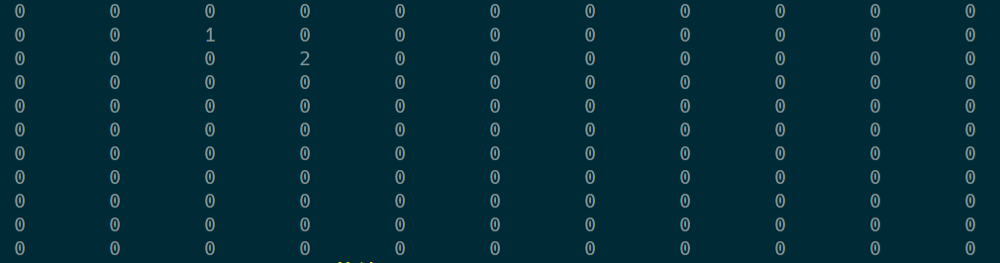
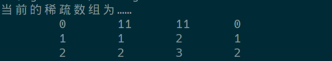
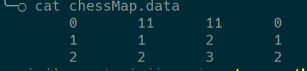
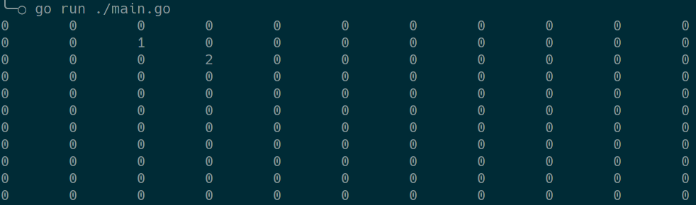

# 算法与数据结构

## 数据结构（算法）的介绍

- 数据结构是一门研究算法的学科，只从有了编程语言就有了数据结构，学好数据结构就可以编写出更漂亮、更有效的代码
- 要学好数据结构要多多考虑如何将生活中遇到的问题用程序去实现解决
- 程序=算法+数据结构
- 数据结构是算法的基石

## 稀疏数组(`sparsearray`)

### 存盘与复盘


#### 原始存盘

```go
//五子棋
func main() {
	//1.先创建一个原始数组--棋盘
	var chessMap [11][11]int
	chessMap[1][2] = 1 //1表示黑子
	chessMap[2][3] = 2 //2表示白子

	//2.输出查看原始的数组
	for _, y := range chessMap {
		for _, x := range y {
			fmt.Printf("%d\t", x)
		}
		fmt.Println()
	}
}
```

- 结果如下



#### 使用稀疏数组存盘

- 存入的数据为



- 代码如下

```go
import (
	"bufio"
	"encoding/json"
	"fmt"
	"os"
)

var F *os.File

type Node struct {
	Y     int `json:"Y"`
	X     int `json:"X"`
	Value int `json:"Value"`
}

//初始化
func CreateWriteReadFile() {
	var err error
	F, err = os.OpenFile("./chessMap.data", os.O_CREATE|os.O_APPEND|os.O_RDWR, 0600)
	if err != nil {
		fmt.Println(err.Error(), "write")
		os.Exit(-1)
	}
}

//将稀疏数组转换为字符串并写入文件
func printSparseArray(SparseArray []Node) {
	//遍历稀疏数组
	writer := bufio.NewWriter(F)
	for _, node := range SparseArray {
		json_str, err := json.Marshal(node) //序列化成json
		if err != nil {
			fmt.Println(err.Error())
			return
		}
		writer.WriteString(string(json_str) + "\n") //将内容写到内存中
		//fmt.Println("写到内存了")
	}
	writer.Flush() //写入文件
}

//五子棋
func WriteFile() {
	CreateWriteReadFile()
	//1.先创建一个原始数组--棋盘
	var chessMap [11][11]int
	chessMap[1][2] = 1 //1表示黑子
	chessMap[2][3] = 2 //2表示白子
	//创建一个Node值结点，存放默认大小和值
	DefaultNode := Node{Y: 11, X: 11, Value: 0}
	//创建一个数组用来存放已使用的位置坐标和值
	var SparseArray []Node
	//将默认大小和值存放到稀疏数组中
	SparseArray = append(SparseArray, DefaultNode)
	//1.遍历chessMap，如果发现有一个元素不为0,创建一个node结构体
	for y, array := range chessMap {
		for x, v := range array {
			if v != 0 {
				//创建一个Node值结点
				ValueNode := Node{X: x, Y: y, Value: v}
				//2.将其放入对应切片即可
				SparseArray = append(SparseArray, ValueNode)
			}
		}
	}
	printSparseArray(SparseArray)
}
```

- 存入文件内容如下



#### 使用稀疏数组复盘

```go
import (
	"bufio"
	"encoding/json"
	"fmt"
	"io"
	"os"
)

type Node1 struct {
	Y     int `json:"Y"`
	X     int `json:"X"`
	Value int `json:"Value"`
}

var SparseArray []Node1

func ReadFile() {
	var err error
	F, err = os.Open("./chessMap.data")
	if err != nil {
		fmt.Println(err.Error(),"read")
		os.Exit(-1)
	}
	reader := bufio.NewReader(F)
	//循环读取文件每一行内容
	for {
		line, err := reader.ReadString('\n')
		if err == io.EOF {
			break
		}
		if err != nil {
			fmt.Println(err.Error())
			os.Exit(-1)
		}
		node := Node1{}
		err = json.Unmarshal([]byte(line), &node)
		if err != nil {
			fmt.Println(err.Error())
			return
		}
		SparseArray = append(SparseArray, node)
	}
	node := SparseArray[0]
	//循环创建棋盘数组
	chessMap1 := make([][]int, node.Y)
	for i := range chessMap1 {
		chessMap1[i] = make([]int, node.X)
	}
	//将已有棋子的位置加入空棋盘中
	for i := 1; i < len(SparseArray); i++ {
		node = SparseArray[i]
		//fmt.Println(node)
		chessMap1[node.Y][node.X] = node.Value
	}
	//遍历打印复盘
	for _, y := range chessMap1 {
		for _, x := range y {
			fmt.Printf("%v\t", x)
		}
		fmt.Println()
	}
}
```

- 结果如下

